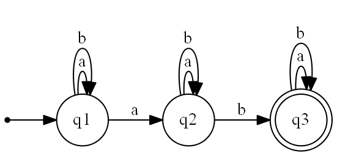

# FSA Tools 2

A set of tools for rendering, processing, solving finite state automata and pushdown automata.

## How to use

```bash
main.py INPUT_FILE
main.py examples/informal1.txt
```

This tool takes a single text file as input. The text file describes the FSA/PDA and lists actions to perform on the FSA/PDA. An input file looks like this:

```
# this is a comment

# state the input format with "format INPUT_FORMAT"
# we will use the "informal" format to describe our FSA

format informal

# state the actions to perform with "action ACTION1 ACTION2 ..."

# "render" - render the described fsa into an image
# "formalise" - describe the fsa using formal mathematical notation, saved to a file

action render formalise

# begin describing the fsa, we're using the "informal" format

start q1
end q3

q1 a q1
q1 b q1
q1 a q2
q2 a q2
q2 b q2
q2 b q3
q3 a q3
q3 b q3
```

After running the above file, it generates an image (`render` action) and a new text file (`formalise` action):

> 
> 
> ```
> format formal
> action render
> 
> {{a,b},{q1,q2,q3},{(q1,a,q1),(q1,a,q2),(q1,b,q1),(q2,a,q2),(q2,b,q2),(q2,b,q3),(q3,a,q3),(q3,b,q3)},q1,{q3}}
> ```

## Implemented actions

These are the actions I implemented:

- `render`: Render the graph.
- `render_combined`: Render the graph while combining transitions from and to the same state.
- `render_in`: Render the graph with an alternative positioning algorithm (order=in).
- `render_in_combined`: Render the graph while combining transitions and with an alternative positioning algorithm.
- `transition_table`: Generate a transition table of the input graph. Output is in Markdown format.
- `deterministic`: Perform subset construction to create a deterministic version of the input graph.
- `formalise`: Express the input graph using formal mathematical notation.
- `unname`: Replace all state names with generic names (`q1`, `q2`, `q3`, ...).
- `epsilon`: Remove epsilon transitions (ε) from the input graph.
- `minimise`: Minimise the input graph using the minimisation routine.
- `clone`: Clone the input graph to a new file. Use this as a template to create your own actions.

Some actions output important information in the console output, like `minimise` which prints a table like this:

```
...

Minimise: Starting...
(x, x,y): One of them is an accepting state
(x, x,y,z): One of them is an accepting state
(x, z): One of them is an accepting state
(x,y, x,y,z): One of them is an accepting state
(x,y, z): One of them is an accepting state
(x,y,z, z): One of them is an accepting state
After marking cells with exactly 1 final state:
   x,y | X |     |
 x,y,z | X |     |
     z | X |     |
=========================
 state | x | x,y | x,y,z

...
```
